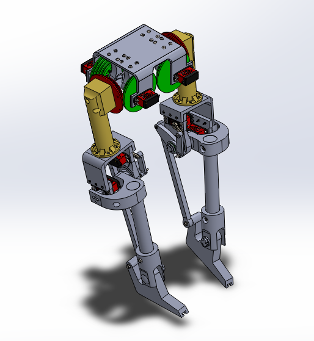

# Bipedal Robot Project

*Inspired by the Westwood Robotics Bruce robot, featuring spherical hip joints.*

## Project Overview
This project involves the development of a bipedal robot inspired by Westwood Robotics' Bruce model, known for its unique spherical hip joints. The goal is to design and simulate a robot that closely replicates human-like movement using closed-loop kinematics and advanced joint mechanics.

## Development Process
### 1. **Design and Modeling**
- The robot's structure is designed with a focus on stability and flexibility, incorporating spherical hip joints to support a wide range of motion.
- A closed-loop kinematic model is used to achieve natural and balanced movements, a structure that poses unique challenges in simulation.

### 2. **Simulation Platform Selection**
- **Current Stage**: Choosing a suitable simulation environment to begin testing.
- **Preferred Platform**: I am leaning towards Gazebo as an initial simulation platform. Gazebo provides a computationally efficient way to familiarize myself with robotics simulation.
- **Future Considerations**: While Gazebo will serve as a starting point, I plan to explore NVIDIA’s Isaac Sim, which requires a VM with an NVIDIA GPU but offers more advanced physics and AI capabilities.

### 3. **Current Challenges**
- **Closed-Loop Kinematics**: Since URDF (Universal Robot Description Format) does not natively support closed-loop structures, implementing my robot’s kinematics in Gazebo requires a workaround. This involves redefining some joints or utilizing alternative formats like SDF (Simulation Description Format) that better handle these constraints.
- **Spherical Hip Joints**: Inspired by the Bruce robot, the hip joints add complexity to the simulation and are a focal point for achieving realistic motion.

## Development Plan
1. **Workspace Re-organizing**: install Ubuntu 22.04 and configure my laptop to dual boot Windows and Ubuntu optimized PC resources.
2. **Platform Familiarization**: Continue gaining experience with Gazebo to perform basic movement and balance testing.
3. **Closed-Loop Workarounds**: Experiment with SDF to integrate the closed-loop kinematics.
4. **Simulation Refinement**: Once the robot’s basic movements are simulated successfully, explore more sophisticated simulations in Isaac Sim to enhance realism.
5. **Reinforcement Learning Integration**: Implement RL algorithms like PPO (Proximal Policy Optimization) to train the robot in achieving stable, human-like walking.

## Future Directions
- Transition to Isaac Sim on a GCP VM to leverage NVIDIA’s advanced physics and GPU capabilities.
- Explore adding foot contact sensors and IMUs for feedback-driven training.
- Integrate real-time control algorithms to improve stability and responsiveness.
